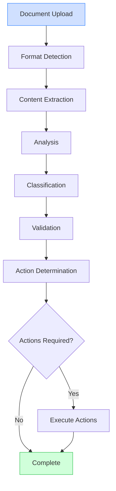
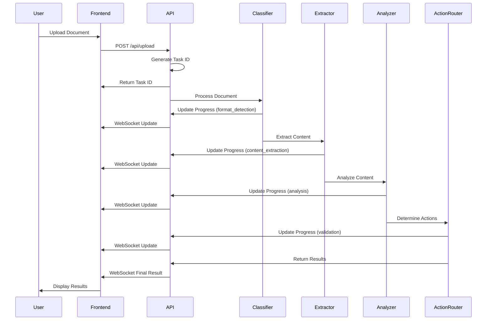
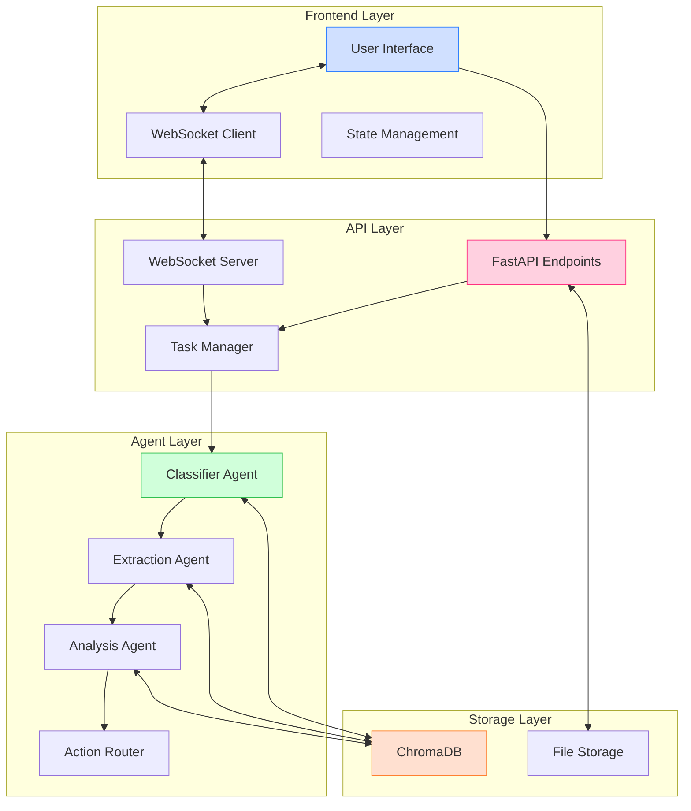

# Agent Flow Diagram

## Document Processing Flow

```mermaid
graph TD
    A[Document Upload] --> B[Format Detection]
    B --> C[Content Extraction]
    C --> D[Analysis]
    D --> E[Classification]
    E --> F[Validation]
    F --> G[Action Determination]
    G --> H{Actions Required?}
    H -- Yes --> I[Execute Actions]
    H -- No --> J[Complete]
    I --> J
    
    style A fill:#d0e0ff,stroke:#3080ff
    style J fill:#d0ffda,stroke:#30c050
```

## Agent Interaction

```mermaid
sequenceDiagram
    participant User
    participant Frontend
    participant API
    participant Classifier
    participant Extractor
    participant Analyzer
    participant ActionRouter
    
    User->>Frontend: Upload Document
    Frontend->>API: POST /api/upload
    API->>API: Generate Task ID
    API->>Frontend: Return Task ID
    API->>Classifier: Process Document
    
    Classifier->>API: Update Progress (format_detection)
    API->>Frontend: WebSocket Update
    
    Classifier->>Extractor: Extract Content
    Extractor->>API: Update Progress (content_extraction)
    API->>Frontend: WebSocket Update
    
    Extractor->>Analyzer: Analyze Content
    Analyzer->>API: Update Progress (analysis)
    API->>Frontend: WebSocket Update
    
    Analyzer->>ActionRouter: Determine Actions
    ActionRouter->>API: Update Progress (validation)
    API->>Frontend: WebSocket Update
    
    ActionRouter->>API: Return Results
    API->>Frontend: WebSocket Final Result
    Frontend->>User: Display Results
```

## Agent Architecture

```mermaid
flowchart TB
    subgraph "Frontend Layer"
        UI[User Interface]
        WS[WebSocket Client]
        State[State Management]
    end
    
    subgraph "API Layer"
        API[FastAPI Endpoints]
        WSS[WebSocket Server]
        TaskMgr[Task Manager]
    end
    
    subgraph "Agent Layer"
        Classifier[Classifier Agent]
        Extractor[Extraction Agent]
        Analyzer[Analysis Agent]
        ActionRouter[Action Router]
    end
    
    subgraph "Storage Layer"
        VectorDB[ChromaDB]
        FileStore[File Storage]
    end
    
    UI --> API
    UI <--> WS
    WS <--> WSS
    API --> TaskMgr
    WSS --> TaskMgr
    TaskMgr --> Classifier
    Classifier --> Extractor
    Extractor --> Analyzer
    Analyzer --> ActionRouter
    
    Classifier <--> VectorDB
    Extractor <--> VectorDB
    Analyzer <--> VectorDB
    API <--> FileStore
    
    style UI fill:#d0e0ff,stroke:#3080ff
    style API fill:#ffd0e0,stroke:#ff3080
    style Classifier fill:#d0ffda,stroke:#30c050
    style VectorDB fill:#ffe0d0,stroke:#ff8030
``` 